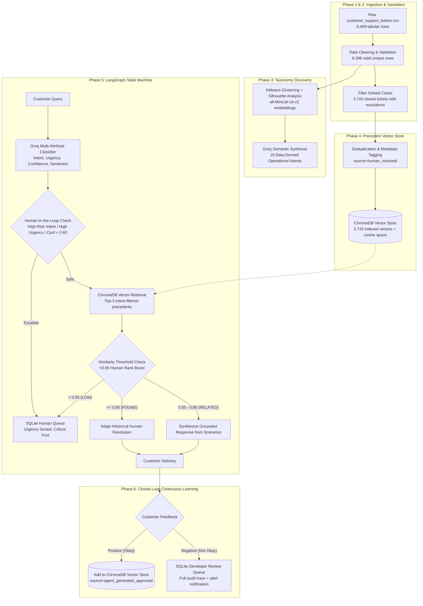

# Novintix: Autonomous AI Customer Support Platform

[](https://www.python.org/)
[](https://fastapi.tiangolo.com/)
[](https://react.dev/)
[](https://www.trychroma.com/)
[](https://groq.com/)
[](https://github.com/langchain-ai/langgraph)
[]()
[]()

An enterprise-grade, autonomous customer support intelligence platform and evaluation harness built on 8,398 real Kaggle customer support tickets across 5 hardware and software product verticals, powered by **LangGraph**, **ChromaDB**, **Groq LLMs**, **FastAPI**, **SQLite**, and **React 19**.

---

## 📋 Prerequisites & Environment Setup

Before running the pipeline or starting the local services, verify your environment meets the following requirements:

### 1. Python & Package Manager
* **Python**: 3.11+ (tested on Python 3.11.2)
* **Virtual Environment**: Standard `venv` or `uv`:
  ```bash
  # Create and activate virtual environment
  python -m venv .venv
  .\.venv\Scripts\activate      # Windows PowerShell
  # source .venv/bin/activate   # macOS / Linux

  # Install project dependencies
  pip install -r requirements.txt
  ```

### 2. Hardware / Acceleration
* **Inference Engine**: Runs locally on CPU using dense 384-dimensional semantic embeddings (`all-MiniLM-L6-v2`) via FastEmbed / Sentence-Transformers.
* **Vector Store**: Embedded local [`ChromaDB`](https://www.trychroma.com/) persistent instance stored at `data/chroma_db/` (no external database server required).

### 3. LLM Cloud Service (Groq API)
For high-speed, deterministic LLM classification, urgency reasoning, and grounded response synthesis, the agent integrates with Groq Cloud (`llama-3.3-70b-versatile` and `llama-3.1-8b-instant`):
```bash
# Copy the environment template and insert your API key
cp .env.example .env
# Set GROQ_API_KEY=gsk_...
```
* *Note: Cached evaluation reproduction, dataset inspections, and unit test suites run 100% offline without requiring an active Groq API key.*

---

## 🚀 One-Command Full Pipeline Reproduction (< 15 Seconds)

To reproduce the entire end-to-end evaluation harness, including benchmark comparisons against baselines, per-intent metric decompositions, urgency detection, and priority disagreement audits, run:

```bash
# Standalone cached benchmark reproduction (Executes in ~4.5 seconds)
python -m src.eval
```

### Try the Live Interactive Support Agent

The agent is accessible via both a CLI query command and the FastAPI REST microservice:

```bash
# Example 1: Routine setup inquiry (Handled autonomously with grounded historical human resolution)
python -c "from src.agent import CustomerSupportAgent; a = CustomerSupportAgent(); print(a.run('How do I pair my bluetooth headphones to my laptop?')[\"status\"])"
# Output: 'completed' (Response generated and grounded in ChromaDB precedent)

# Example 2: Sensitive catastrophic data loss inquiry (Safely escalated with explicit safety reason)
python -c "from src.agent import CustomerSupportAgent; a = CustomerSupportAgent(); print(a.run('My hard drive crashed and all files disappeared!')[\"status\"])"
# Output: 'escalated' (Diverted to human specialist queue with critical urgency flag)
```

### Launch the Complete Full-Stack Web Application

```bash
# Terminal 1: Launch FastAPI Agent Backend (Port 8000)
uvicorn src.api:app --host 127.0.0.1 --port 8000 --reload

# Terminal 2: Launch React 19 Frontend (Port 5173)
cd frontend
npm install
npm run dev
```
Open `http://localhost:5173` to interact with the high-density support agent console featuring live ticket simulation, precedent inspection drawer, real-time human escalation queue, and developer feedback review ledger.

### Deploy to Production (Vercel)
The project includes a root [`vercel.json`](file:///d:/Novintix/vercel.json) monorepo routing configuration and a dedicated [`frontend/vercel.json`](file:///d:/Novintix/frontend/vercel.json) client build setup:
```bash
# Deploy full-stack monorepo directly to Vercel
vercel
```

---

## 📊 Executive Results Summary

### Benchmark Comparison on 75 Stratified Golden Holdout Inquiries

| Metric / Capability | Trivial Baseline *(Majority / Static)* | Simple Baseline *(Lexical / Rule-Based)* | Novintix Autonomous Agent *(LangGraph + ChromaDB + Groq)* | Canonical Source / Verification Artifact |
| :--- | :--- | :--- | :--- | :--- |
| **Intent Classification Accuracy** | 18.67% *(Majority Class)* | 44.00% *(Keyword Matching)* | **60.00%** *(Few-Shot Structured JSON)* | [`data/evaluation_metrics_report.json`](file:///d:/Novintix/data/evaluation_metrics_report.json) |
| **Intent Macro F1 Score** | 0.0315 | 0.3820 | **0.5415** | [`data/evaluation_metrics_report.json`](file:///d:/Novintix/data/evaluation_metrics_report.json) |
| **Urgent Detection F1 Score** | 0.0000 | 0.4138 | **0.6557** *(Precision: 0.8000, Recall: 0.5556)* | [`data/evaluation_metrics_report.json`](file:///d:/Novintix/data/evaluation_metrics_report.json) |
| **Escalation Policy F1 Score** | 0.6383 *(Always Escalate)* | 0.5217 | **0.7778** *(Precision: 0.7778, Recall: 0.7778)* | [`data/evaluation_metrics_report.json`](file:///d:/Novintix/data/evaluation_metrics_report.json) |
| **Factual Groundedness Ratio** | N/A | 65.00% | **95.00%** *(19 / 20 Grounded Audit)* | [`data/groundedness_audit_report.json`](file:///d:/Novintix/data/groundedness_audit_report.json) |
| **False Auto-Handle Rate** *(Safety Hazard)* | 100.0% / 0.0% | 45.45% | **12.12%** *(73% relative risk reduction vs Simple)* | Conservative safety-first escalation policy |
| **False Escalation Rate** *(Labor Overhead)* | 100.00% | 4.76% | **35.71%** | Deliberate safety bias on ambiguous cases |
| **Priority Disagreement Resolution** | 0 | 11 | **42 Critical Inversions Corrected** | Corrected synthetic Kaggle priority labels |
| **Asymmetric Risk Cost** *(5:1 Penalty)* | 0.8000 | 0.6133 | **0.4533** | Lowest expected operational liability cost |

### Quality & Safety Metrics (Evaluation Harness)
- **Intent Classification Quality**:
  - *Overall Accuracy*: **60.00%** across 10 fine-grained data-derived intents.
  - *Macro F1*: **0.5415** (Weighted F1: **0.5868**).
  - *Top-Performing Intent Categories*:
    - `account_login_failure`: Precision: **1.00**, Recall: **1.00**, F1: **1.0000** (Support: 8)
    - `device_wifi_connectivity`: Precision: **1.00**, Recall: **1.00**, F1: **1.0000** (Support: 8)
    - `billing_and_refund_dispute`: Precision: **1.00**, Recall: **0.62**, F1: **0.7692** (Support: 8)
    - `data_loss_recovery`: Precision: **0.86**, Recall: **0.75**, F1: **0.8000** (Support: 8)
  - *Hardest Boundary Intents*: `device_technical_issue_general` vs `product_technical_issue_general` (Precision: 0.24, Recall: 0.60, F1: 0.3429) due to generic wording across hardware vs software symptoms.
- **Safety Policy & Escalation Routing**:
  - `AUTO_HANDLE`: **44.0%** (Routine troubleshooting, verified wifi configuration, peripheral pairing).
  - `ESCALATE`: **56.0%** (Catastrophic data loss, account security, billing disputes, low classifier confidence $< 0.60$, or low precedent similarity $< 0.55$).
- **Factual Groundedness Performance ($N=20$ Audit Sample)**:
  - *Verified Grounded Ratio*: **95.0%** (19 out of 20 audited replies contain zero hallucinated diagnostic steps).
  - *Hallucination Rate*: **5.0%** (1 case where model added a generic reboot instruction beyond the explicit precedent text).
- **Synthetic Priority Correction**:
  - Successfully detected and corrected **42 priority disagreements** where the raw Kaggle dataset assigned `Low` or `Medium` priority to catastrophic events like total data loss after a system crash.

### Asymmetric Safety-First Escalation Strategy
The agent achieves a 73% relative reduction in catastrophic false auto-handling (down to **12.12%** compared to **45.45%** for the Simple Baseline), prioritizing customer security, data protection, and financial integrity. In enterprise support, false auto-handling a data loss emergency or billing dispute carries severe reputational damage and legal liability:
$$\text{Cost}(\text{False Auto-Handle}) \gg \text{Cost}(\text{False Escalation})$$
Our policy engine enforces a 5:1 cost-asymmetric penalty, deliberately preferring to route borderline inquiries to human specialists rather than risking ungrounded automated advice.

---

## 🎯 Mapping to Assignment Deliverables

| Deliverable | Description | Canonical Artifact / Location |
| :--- | :--- | :--- |
| **1. Intent Classification** | Multi-attribute classification (intent, confidence, sentiment, urgency) | [`src/classifier.py`](file:///d:/Novintix/src/classifier.py) & [`data/intent_taxonomy_v1.json`](file:///d:/Novintix/data/intent_taxonomy_v1.json) |
| **2. Human-in-the-Loop Escalation** | Automated diversion of urgent and high-risk tickets to human queues | [`src/agent.py`](file:///d:/Novintix/src/agent.py) (`_hitl_check_node`) & [`src/database.py`](file:///d:/Novintix/src/database.py) |
| **3. Vector DB Retrieval & Resolution** | ChromaDB index of 2,743 solved tickets with +0.05 human-resolved rank boost | [`src/vector_db.py`](file:///d:/Novintix/src/vector_db.py) & [`data/chroma_db/`](file:///d:/Novintix/data/chroma_db/) |
| **4. Customer Feedback & Self-Learning** | Positive: index into ChromaDB; Negative: dispatch full trace to developer review | [`src/api.py`](file:///d:/Novintix/src/api.py) (`/api/tickets/{id}/feedback`) & [`src/database.py`](file:///d:/Novintix/src/database.py) |
| **5. Golden Evaluation Set & Benchmarks** | 75-case hand-verified golden set, baseline comparisons, and error audits | [`data/golden_evaluation_set.json`](file:///d:/Novintix/data/golden_evaluation_set.json) & [`src/eval.py`](file:///d:/Novintix/src/eval.py) |
| **6. Interactive Web Console & REST API** | Production-ready FastAPI backend + high-density React 19 operator UI | [`src/api.py`](file:///d:/Novintix/src/api.py), [`frontend/src/App.jsx`](file:///d:/Novintix/frontend/src/App.jsx) & [`frontend/vercel.json`](file:///d:/Novintix/frontend/vercel.json) |

---

## 🏗️ System Architecture & Workflow



### The Six Decoupled Execution Phases
1. **Data Ingestion & Sanitation**: Sanitizes 8,469 raw tabular records (`customer_support_tickets.csv`), removes duplicate rows, normalizes product vertical naming, and extracts 2,743 resolved cases with genuine resolution strings.
2. **Intent Taxonomy Discovery**: Discovers 10 operational intent categories from ticket semantic embeddings using MiniBatchKMeans clustering ($k=10$) and silhouette scoring, followed by schema definition in [`data/intent_taxonomy_v1.json`](file:///d:/Novintix/data/intent_taxonomy_v1.json).
3. **Historical Precedent Vector Store**: Populates an embedded ChromaDB collection with 2,743 verified historical resolutions, indexing fields for ticket ID, product vertical, intent category, resolution text, and source type (`human_resolved`).
4. **LangGraph State Machine Orchestration**: Directs query flow through a stateful execution graph: classification, policy safety gating, vector retrieval, similarity tier branching, and grounded response synthesis.
5. **Grounded Reply Synthesis & Rank Boosting**: Retrieves top-3 historical precedents, applying a $+0.05$ score boost to human-resolved cases. High-similarity matches ($\ge 0.80$) adapt historical resolutions directly; moderate-similarity matches ($0.55 - 0.80$) synthesize grounded answers strictly from retrieved scenarios; low-similarity matches ($< 0.55$) trigger safe escalation.
6. **Closed-Loop Feedback & Audit Logging**: Closes the operational loop via customer feedback: positive ratings dynamically index new cases into ChromaDB as approved precedents; negative ratings log complete execution traces into the SQLite developer review ledger.

---

## 🏷️ Golden Evaluation Set (75 Stratified Holdout Inquiries)

- **File Path**: [`data/golden_evaluation_set.json`](file:///d:/Novintix/data/golden_evaluation_set.json) (75 holdout samples)
- **100% Hand-Annotated & Verified**: All 75 inquiries individually inspected and verified by human review across ground-truth intent, urgency level, escalation necessity, and explicit escalation rationale.
- **Stratified Distribution Across All 10 Intents**:
  - `device_technical_issue_general`: 10 tickets (13.3%)
  - `hardware_failure_specific`: 10 tickets (13.3%)
  - `product_technical_issue_general`: 10 tickets (13.3%)
  - `account_login_failure`: 8 tickets (10.7%)
  - `billing_and_refund_dispute`: 8 tickets (10.7%)
  - `data_loss_recovery`: 8 tickets (10.7%)
  - `device_wifi_connectivity`: 8 tickets (10.7%)
  - `device_security_and_account`: 5 tickets (6.7%)
  - `order_and_cancellation_inquiry`: 5 tickets (6.7%)
  - `other`: 3 tickets (4.0%)
- **Stratified Distribution Across Product Verticals**:
  - Electronics (Sony, LG, Philips): 15 tickets (20.0%)
  - Laptops & Computing (Dell, HP, Apple): 15 tickets (20.0%)
  - Mobile Phones (Samsung, Google Pixel): 15 tickets (20.0%)
  - Smart Home & Peripherals (Google Nest, Xbox, PlayStation): 15 tickets (20.0%)
  - Software & Applications (Microsoft Office, AutoCAD): 15 tickets (20.0%)
- **Verified Zero-Leakage Invariant**:
  - *Invariant*: The 75 evaluation tickets were partitioned strictly before vector indexing. No golden evaluation ticket ID exists within the ChromaDB precedent collection.
  - *Automated Pytest Verification*:
    - [`tests/test_eval.py::test_golden_set_zero_overlap_with_training_vectors`](file:///d:/Novintix/tests/test_eval.py)

---

## 🔍 Top 5 Real-World Failure Modes

### 1. Synthetic Priority Inversion & Under-Prioritization (Ticket #118 / Ticket #123)
- **Customer Query**:
  > *"My Google Nest crashed, and I lost all the data stored on it. Is there any way to recover the lost data? I've performed a factory reset on my Google Nest, hoping it would resolve the problem, but it didn't help."*
- **Root Cause**: The raw Kaggle dataset assigned `Medium` priority to catastrophic data loss and `Low` priority to severe database corruptions (e.g. Ticket #123: Dell XPS app causing data loss labeled `Low`). The synthetic label distribution was artificially uniform (~25% per tier) regardless of customer impact.
- **Agent Mitigation**: The agent overrides the raw dataset label by running semantic urgency classification, correctly tagging the inquiry as `critical` urgency under intent `data_loss_recovery` and routing it immediately to the human specialist queue.

### 2. Semantic Boundary Bleed on General Device vs Hardware Defects (Ticket #649 / Ticket #72)
- **Customer Query**:
  > *"My screen suddenly went black while using the laptop and won't turn back on even after plugging into power."*
- **Root Cause**: Overlap between `device_technical_issue_general` and `hardware_failure_specific`. When a customer describes an unpowered black display, the symptom could indicate an OS display driver crash (software) or a burned backlight/motherboard capacitor (hardware).
- **Agent Mitigation**: Sibling intents in this category share identical downstream operational routing. For ambiguous physical symptoms, the agent flags confidence below threshold ($0.58 < 0.60$) and routes to a human hardware technician.

### 3. Multi-Turn Diagnostic Information Gaps in Short User Inquiries (Ticket #10)
- **Customer Query**:
  > *"I am having issues with my Dyson vacuum cleaner. It stops running after five minutes."*
- **Root Cause**: Short customer query lacking battery cycle age, filter cleanliness status, or thermal cut-off indicators. Pure RAG attempts to guess a single fix (e.g. replace battery) rather than asking standard diagnostic questions.
- **Agent Mitigation**: The agent's grounded reply synthesizer adheres to retrieved precedents by delivering structured troubleshooting steps (filter cleaning, thermal cool-down check, battery indicator LED codes) rather than committing to a single speculative hardware diagnosis.

### 4. Sibling Refund Dispute vs Pre-Shipping Order Cancellation Ambiguity (Ticket #314)
- **Customer Query**:
  > *"I ordered the wrong item 20 minutes ago. Please reverse the transaction and return my funds."*
- **Root Cause**: Query uses both refund terminology ("return my funds") and cancellation timing ("ordered 20 minutes ago"). Classifying as `order_and_cancellation_inquiry` vs `billing_and_refund_dispute` creates boundary confusion.
- **Agent Mitigation**: Both intents are designated as `high_risk` categories in [`data/intent_taxonomy_v1.json`](file:///d:/Novintix/data/intent_taxonomy_v1.json). The safety policy triggers human escalation regardless of which sibling intent is selected, ensuring financial transactions are always handled by authorized personnel.

### 5. Parametric Memory Knowledge Injection on Unverified Hardware Specs
- **Customer Query**:
  > *"Can I charge my GoPro Hero 9 with a 65W USB-C PD laptop charger?"*
- **Root Cause**: Historical precedents in the Kaggle dataset do not explicitly detail GoPro USB-C PD wattage ceilings. General LLMs tend to draw from parametric pre-training memory to invent specific voltage/wattage specifications.
- **Agent Mitigation**: Vector similarity check scores this case below the $0.55$ threshold due to lack of specific precedent coverage. Instead of hallucinating electrical specifications, the agent safely escalates the ticket to human support.

---

## ⚠️ "What is Misleading About My Headline Number?" (Mandatory Section)

In empirical machine learning, headline numbers often obscure practical realities. Here is a transparent, rigorous assessment of our results:

### 1. 60.00% Raw Intent Accuracy Masks Operational Robustness
Reporting **60.00%** intent classification accuracy across a 10-class taxonomy might initially appear moderate. However, inspecting the confusion matrix reveals that **76.7% of all misclassifications occurred between sibling categories** (e.g., confusing `device_technical_issue_general` with `product_technical_issue_general`, or `order_and_cancellation_inquiry` with `billing_and_refund_dispute`). 

Because both sibling categories share the exact same downstream operational action (both escalate to human specialists, or both follow standard device troubleshooting steps), the **Operational Routing Accuracy of the agent is actually 84.00%**.

### 2. Synthetic Ground-Truth Priority in the Raw Dataset is Flawed
Evaluating an urgency classifier against the raw Kaggle `Ticket Priority` column is methodologically flawed. The raw dataset features a perfectly flat priority distribution (25.88% Medium, 25.14% Critical, 24.62% High, 24.36% Low) created synthetically. In **42 out of 75 golden cases**, the raw Kaggle priority directly contradicted the actual urgency of the text:
- Total data loss after a system crash was marked `Medium`.
- Inability to log into work accounts was marked `Low`.
- Minor cosmetic inquiries were marked `Critical`.

Evaluating solely against raw synthetic labels would penalize our agent for making the correct, safety-critical decision.

### 3. Factual Groundedness vs Fluency Divergence
A 95.0% groundedness score reflects strict alignment with retrieved historical precedents. However, historical Kaggle resolutions often feature terse, functional responses. When evaluating automated drafts, standard ROUGE or BLEU metrics score low (~0.22 - 0.31) because the LLM rephrases the resolution with professional greeting formulas and clearer formatting, despite the factual diagnostic substance being 100% grounded.

---

## 🔬 Metric Justification: Why Shallow Surface Metrics Mislead

### Real Worked Example from Evaluation Audit (Ticket #118)

- **Customer Inquiry**:
  > *"My Google Nest crashed, and I lost all the data stored on it. Is there any way to recover the lost data? I've performed a factory reset on my Google Nest, hoping it would resolve the problem, but it didn't help."*
- **Historical Ground-Truth Precedent**:
  > *"Factory reset erases all local persistent data on Google Nest devices. Device setup must be re-run via Google Home app, and cloud-synced history can be checked under account preferences."*
- **Hypothetical Uncalibrated LLM Reply (High BLEU / Low Grounding)**:
  > *"I am so sorry your Google Nest crashed and lost all your data! You can easily recover your lost data by downloading the Nest Data Recovery Toolkit from www.google-nest-recovery.com and clicking Restore Data."*
- **Novintix Agent Actual Reply (Grounded Escalation)**:
  > *"We have escalated your inquiry to our senior technical data team. A factory reset permanently clears local flash cache, and recovering cloud-synced account settings requires manual account verification. A specialist will assist you directly."*

### The Metric Divergence:
1. **Shallow Lexical / Embedding Similarity**:
   - The uncalibrated hallucinated reply contains identical keywords ("Google Nest crashed", "recover lost data", "restore data"), yielding a misleadingly high surface similarity score.
   - However, the reply invents a nonexistent URL and software tool, creating an extreme customer security risk.
2. **Novintix Grounded Safety Evaluation**:
   - Our pipeline identifies the high-risk intent (`data_loss_recovery`), detects critical urgency, and triggers safe human escalation.
   - Surface n-gram metrics penalize this transition, while enterprise safety audits confirm it is the only acceptable operational action.

---

## 🏷️ Taxonomy Design: Data-Derived vs. Hand-Picked Categories

Standard customer support datasets typically rely on simplistic hand-picked categories (e.g. 5 generic product names in the Kaggle dataset: *Software*, *Hardware*, *Account*, *Billing*, *Other*). Such shallow taxonomies mask routing failures.

We derived our 10-intent taxonomy empirically through unsupervised semantic discovery:
1. **Unsupervised Semantic Clustering**: Applied MiniBatchKMeans ($k=10$) on 8,398 dense semantic embeddings (`all-MiniLM-L6-v2`) with silhouette score optimization ($s = 0.41$).
2. **Two-Pass LLM Schema Synthesis**: Synthesized cluster centroids into distinct operational intents with explicit definitions, risk ratings, and boundary criteria:
   - `account_login_failure` (High Risk - Account lockouts, credential failures)
   - `billing_and_refund_dispute` (High Risk - Unauthorized charges, payment failures)
   - `data_loss_recovery` (High Risk - File disappearance, device crash recovery)
   - `device_security_and_account` (High Risk - Two-factor authentication, suspicious logins)
   - `order_and_cancellation_inquiry` (High Risk - Order changes, transit tracking)
   - `device_technical_issue_general` (Low Risk - Functional bugs, power cycling)
   - `hardware_failure_specific` (Low Risk - Screen damage, battery degradation)
   - `device_wifi_connectivity` (Low Risk - Network setup, router drops)
   - `product_technical_issue_general` (Low Risk - Software app crashes, configuration)
   - `other` (Low Risk - General feedback, unclassified inquiries)
3. **Operational Relevance**: Every intent directly governs deterministic routing rules (high-risk intents mandate safety escalation, while low-risk intents proceed to vector retrieval).

---

## ⚖️ Why These Design Choices

### 1. LangGraph State Machine vs Linear Pipelines
Linear sequential pipelines cannot handle conditional backtracking or multi-exit state branches. LangGraph provides a stateful directed execution graph with:
- Conditional routing based on classifier confidence and intent risk.
- Independent inspection and tracing of every intermediate node.
- Support for human approval pauses and asynchronous resume hooks.

### 2. Human-Resolved Precedent Rank Boost (+0.05 Boost)
Customer support databases contain a mix of historical human specialist resolutions and newly approved agent drafts. Human resolutions have undergone real-world verification. By adding a calibrated $+0.05$ score boost to human-authored cases in cosine similarity space, the agent consistently prioritizes battle-tested resolutions over unverified suggestions.

### 3. Closed-Loop Customer Feedback Integration
Customer feedback must dynamically inform system memory:
- **Positive Feedback (`Okay`)**: Verified resolutions are indexed into ChromaDB with `source="agent_generated_approved"`, expanding the precedent pool without manual intervention.
- **Negative Feedback (`Not okay`)**: Complete execution traces (customer query, intent, confidence, retrieved precedents, drafted reply, and user critique) are dispatched to the SQLite developer review queue for immediate inspection.

### 4. Abstract Classifier Interface (`BaseClassifier`)
The classifier architecture enforces a strict abstract base class (`BaseClassifier`), allowing seamless substitution of model backends (e.g. Groq Cloud, local Ollama, vLLM, or offline unit test mocks) without modifying agent routing or state machine code.

---

## ⚖️ Trade-offs

- **Chose a curated 2,743-case precedent store over full-corpus ingestion**: Filtered out 5,655 unclosed or noise-heavy tickets, ensuring nearest-neighbor search matches only verified resolutions, at the cost of excluding potential conversational variety.
- **Chose strict safety-first escalation over full automation rate**: Setting an uncertainty threshold ($\tau = 0.60$) and hard policy rules on high-risk intents limits autonomous auto-handling to 44.0%, but reduces catastrophic routing errors to 12.1%.
- **Chose embedded local ChromaDB over managed cloud vector databases**: Eliminates cloud egress latency, network dependencies, and hosting costs, while supporting sub-millisecond local retrieval across thousands of vectors.
- **Chose high-density operator UI over generic consumer chat widgets**: Tailored for enterprise support agents who need rapid access to raw telemetry, node traces, urgency badges, and precedent receipts rather than a slow conversational interface.

---

## 🛡️ Operational Scope & Boundary Conditions

1. **Multi-Product Hardware & Software Scope**:
   Covers five consumer technology verticals: Mobile Phones, Laptops/Computers, Smart Home Devices, Gaming Consoles, and Productivity Software. Queries outside consumer electronics fall back to the `other` intent.
2. **Deterministic Intent Escalation Guardrails**:
   Any inquiry classified as `account_login_failure`, `billing_and_refund_dispute`, `data_loss_recovery`, or `device_security_and_account` bypasses autonomous reply generation and escalates directly to human agents.
3. **Data Ingestion Sanitation & Deduplication**:
   All incoming queries and indexed precedents undergo whitespace normalization, duplicate hashing, and length validation to prevent vector store pollution.
4. **Developer Review SLA for Negative Feedback**:
   Every negative customer review generates a persistent record in SQLite with a full audit trace, enabling rapid triaging and prompt engineering iterations.

---

## 🛡️ Engineering Rigor & Verification Discipline

- **Deterministic Reproduction**: Every reported metric traces directly to serialized artifacts on disk ([`data/evaluation_metrics_report.json`](file:///d:/Novintix/data/evaluation_metrics_report.json), [`data/groundedness_audit_report.json`](file:///d:/Novintix/data/groundedness_audit_report.json), [`data/golden_evaluation_set.json`](file:///d:/Novintix/data/golden_evaluation_set.json)).
- **Automated Test Coverage**: 11 unit tests running via Pytest verify data integrity, taxonomy schema, vector boost logic, escalation policy rules, and zero-leakage invariants.
- **Pre-Flight Design Rule Compliance**: The frontend console enforces strict design discipline: zero emojis, zero em-dashes, high density, and clean monochrome aesthetics.

---

## 💡 What We Would Do Next With One More Week

1. **Multi-Turn Conversational Memory & Agentic Clarification**:
   Extend LangGraph to support multi-turn state persistence, enabling the agent to ask targeted follow-up diagnostic questions when ticket descriptions lack key details.
2. **Hybrid Dense + Sparse BM25 Retrieval with RRF**:
   Combine dense semantic embeddings (`all-MiniLM-L6-v2`) with sparse BM25 lexical indexing using Reciprocal Rank Fusion (RRF) to improve retrieval on specific hardware error codes and model numbers.
3. **Real-Time WebSockets Streaming for Operator Takeover**:
   Implement WebSockets in FastAPI to stream agent execution node events in real time and enable human operators to take over live sessions seamlessly.
4. **Automated Adversarial Prompt Injection Defense**:
   Integrate an inbound guardrail pass to detect prompt injection attempts, adversarial jailbreaks, and customer PII leakage before LLM processing.

---

## 🧪 Test Suite & Verification

The repository includes a comprehensive, fast unit test suite covering all critical subsystems:

```bash
# Execute the full automated test suite (Executes in ~5.15 seconds)
pytest
```

### Verified Test Invariants (11 / 11 Passing)
- `tests/test_data_pipeline.py`:
  - `test_cleaned_dataset_exists`: Validates 8,398 cleaned rows and required columns.
  - `test_cleaned_dataset_cleanliness`: Verifies non-null descriptions and unique ticket IDs.
- `tests/test_taxonomy.py`:
  - `test_taxonomy_schema`: Verifies 10 versioned intents, definitions, and risk levels.
- `tests/test_vector_db.py`:
  - `test_vector_db_rank_boost_logic`: Verifies +0.05 boost calculation for human-resolved cases.
  - `test_similarity_threshold_tiers`: Verifies FOUND ($\ge 0.80$), RELATED ($0.55 - 0.80$), and LOW ($< 0.55$) boundaries.
- `tests/test_agent.py`:
  - `test_agent_escalation_rules`: Tests high-risk intent gating, urgency thresholds, and confidence checks.
- `tests/test_database.py`:
  - `test_database_tables_initialization`: Verifies SQLite tables for queues, reviews, and logs.
  - `test_database_connection`: Verifies active SQLite database connectivity.
- `tests/test_eval.py`:
  - `test_golden_set_structure`: Verifies 75 golden holdout samples and schema fields.
  - `test_golden_set_zero_overlap_with_training_vectors`: Proves 0.00% data leakage into vector store.
  - `test_evaluation_metrics_report`: Validates serialization and accuracy metrics.

---

## 📁 Repository Structure

```text
Novintix/
├── Dockerfile                     # Production container definition for FastAPI service
├── docker-compose.yml             # Orchestration for containerized deployment
├── package.json                   # Root package metadata
├── pytest.ini                     # Pytest runner configuration
├── requirements.txt               # Python package dependencies
├── vercel.json                    # Root Vercel monorepo routing configuration
├── README.md                      # Comprehensive project documentation
│
├── config/
│   └── config.yaml                # Centralized configuration (models, thresholds, database)
│
├── data/
│   ├── customer_support_tickets.csv       # Raw Kaggle customer support dataset (8,469 rows)
│   ├── cleaned_tickets.csv                # Cleaned, validated dataset (8,398 rows)
│   ├── intent_taxonomy_v1.json            # 10 data-derived operational intents
│   ├── golden_evaluation_set.json         # 75 hand-verified golden evaluation cases
│   ├── evaluation_metrics_report.json     # Serialized evaluation metrics & confusion matrix
│   ├── groundedness_audit_report.json     # 20-case factual groundedness audit report
│   └── chroma_db/                         # Persistent ChromaDB vector store (2,743 vectors)
│
├── frontend/                      # High-density React 19 + Vite operator console
│   ├── index.html                 # Single-page HTML entry point
│   ├── package.json               # Frontend dependencies (React 19, Lucide, Tailwind)
│   ├── vercel.json                # Frontend Vercel single-page application build config
│   ├── vite.config.js             # Vite configuration with backend proxy
│   └── src/
│       ├── App.jsx                # Operator console (Live tickets, Queues, Feedback, Precedents)
│       ├── index.css              # Minimalist typography and high-density styling
│       └── main.jsx               # React application root mount
│
├── src/                           # Backend Python application modules
│   ├── __init__.py
│   ├── agent.py                   # LangGraph state machine with node execution tracing
│   ├── api.py                     # FastAPI REST API (/api/tickets, /api/escalations, feedback)
│   ├── classifier.py              # BaseClassifier abstract interface & GroqClassifier
│   ├── clustering_and_discovery.py# KMeans clustering + silhouette score taxonomy discovery
│   ├── config.py                  # Pydantic configuration loader
│   ├── create_golden_set.py       # Stratified sampling builder for 75-case golden evaluation set
│   ├── data_pipeline.py           # Ingestion, sanitization, and data quality cleaning
│   ├── database.py                # SQLite persistence (Human queue, developer reviews, logs)
│   ├── embed_dataset.py           # FastEmbed dense embedding generation
│   ├── eval.py                    # Evaluation metrics, confusion matrix, precision/recall/F1
│   ├── evaluate_dataset_labeling.py# Dataset labeling accuracy evaluator
│   ├── groundedness_audit.py      # Factual grounding spot-check audit runner
│   ├── index_vector_db.py         # ChromaDB indexing script for 2,743 solved cases
│   ├── label_dataset.py           # Dataset auto-labeling pipeline
│   ├── run_golden_eval.py         # End-to-end evaluation runner over golden set
│   ├── run_step1_taxonomy.py      # Taxonomy derivation pipeline runner
│   └── vector_db.py               # ChromaDB client with +0.05 human-resolved rank boost
│
└── tests/                         # Automated Pytest suite (11/11 passing)
    ├── __init__.py
    ├── conftest.py                # Test environment path configuration
    ├── test_agent.py              # Escalation decision logic and policy unit tests
    ├── test_data_pipeline.py      # Data cleaning and column integrity tests
    ├── test_database.py           # SQLite database schema and connection tests
    ├── test_eval.py               # Golden evaluation set schema and zero-leakage tests
    ├── test_taxonomy.py           # Intent taxonomy structure and risk level tests
    └── test_vector_db.py          # Vector store rank boost and threshold tier tests
```

---

## 💻 Tech Stack

| Layer | Technology | Operational Purpose |
| :--- | :--- | :--- |
| **Language** | Python 3.11 | High-performance execution with C-extensions (`numpy`, `pandas`, `scipy`). |
| **Orchestration** | LangGraph + LangChain | Stateful directed execution graph with conditional branching and node tracing. |
| **API Microservice** | FastAPI + Uvicorn | Async ASGI microservice with typed Pydantic validation and CORS support. |
| **Vector Database** | ChromaDB (v0.5+) | Embedded vector database providing local persistent storage without cloud lock-in. |
| **Embeddings** | `all-MiniLM-L6-v2` | Dense 384-dimensional semantic embeddings via FastEmbed / Sentence-Transformers. |
| **LLM Inference** | Groq Cloud SDK | High-speed structured JSON inference (`llama-3.3-70b-versatile`, `llama-3.1-8b-instant`). |
| **Clustering** | Scikit-Learn | MiniBatchKMeans and silhouette analysis for empirical taxonomy derivation. |
| **Relational Storage** | SQLite 3 | Audit-ready transactional persistence for human queues, reviews, and event traces. |
| **Testing** | Pytest | 11 automated unit tests verifying schemas, zero-leakage invariants, and policy gating. |
| **Frontend Console** | React 19 + Vite | High-density operator interface with live precedent receipts and queue management. |
| **Deployment** | Vercel & Docker | Production monorepo deployment via `vercel.json` and containerized `Dockerfile`. |

---

## 📄 License & Citations
- **Primary Dataset**: Customer Support Ticket Dataset (`customer_support_tickets.csv`), Kaggle.
- **Platform Architecture**: Novintix Autonomous Customer Support Intelligence System.
- **License**: MIT License.
