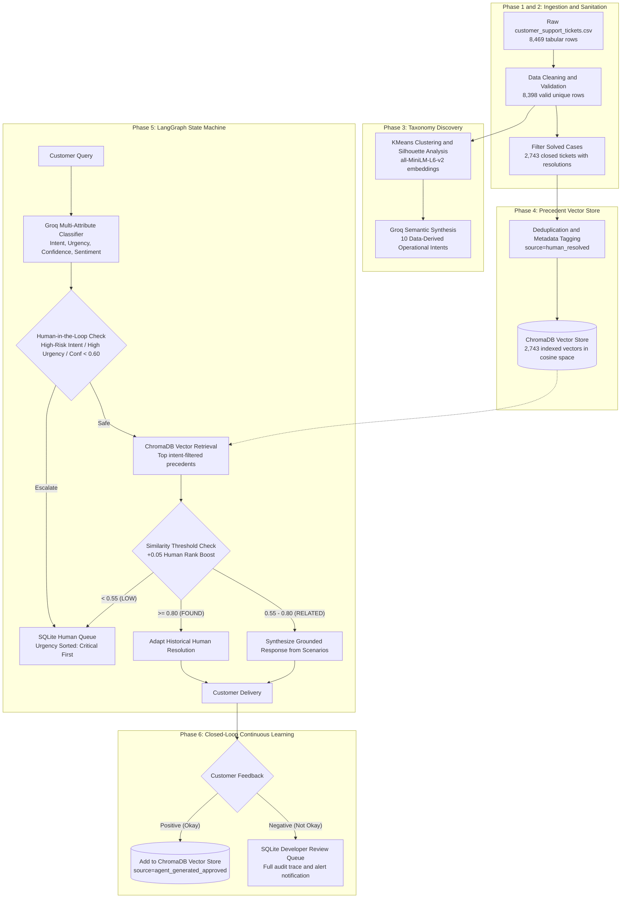

# Novintix Customer Support Agent

[](https://www.python.org/)
[](https://fastapi.tiangolo.com/)
[](https://react.dev/)
[](https://www.trychroma.com/)
[](https://groq.com/)
[](https://github.com/langchain-ai/langgraph)

Novintix Customer Support Agent is a triage and response agent that classifies customer queries, enforces safety routing rules, retrieves relevant historical resolutions, and directs high-liability or urgent tickets to human specialists. The system is evaluated on 8,398 cleaned tickets from a Kaggle customer support dataset that is synthetic, covering consumer hardware and software support inquiries across five product categories.

---

## Design and Strengths

### System Workflow
The agent manages ticket processing through a six-phase architecture orchestrated by a LangGraph state machine:



The six execution phases operate as follows:
1. Data Ingestion and Sanitation: Sanitizes 8,469 raw records from `data/customer_support_tickets.csv`, drops invalid or corrupted rows, normalizes product vertical naming, and extracts 2,743 closed tickets with non-empty resolution text into `data/cleaned_tickets.csv`.
2. Taxonomy Discovery: Discovers 10 operational intent categories from dense semantic embeddings using clustering and silhouette analysis, saved in [data/intent_taxonomy_v1.json](file:///d:/Novintix/data/intent_taxonomy_v1.json).
3. Precedent Vector Store: Populates an embedded ChromaDB collection at `data/chroma_db/` with 2,743 verified historical resolutions, indexing ticket ID, product, intent, resolution text, and source type (`human_resolved`).
4. LangGraph State Machine Orchestration: Executes queries through a stateful graph comprising single-pass classification, deterministic safety gating, vector retrieval, similarity tier evaluation, and response generation.
5. Grounded Reply Synthesis and Rank Boosting: Retrieves intent-filtered precedents from ChromaDB, applying a +0.05 score boost to human-resolved cases. High-similarity matches (score >= 0.80) adapt historical resolutions; moderate-similarity matches (0.55 to 0.80) synthesize answers strictly bounded by retrieved scenarios; low-similarity matches (< 0.55) trigger safe escalation.
6. Closed-Loop Continuous Learning: Persists execution logs and customer feedback in SQLite. Positive ratings index approved cases into ChromaDB; negative ratings log complete execution traces into the developer review queue.

### Safety-First Routing
The agent routes queries to a human queue prior to automated generation whenever risk signals are detected. In `_hitl_check_node` ([src/agent.py](file:///d:/Novintix/src/agent.py)), a ticket escalates if it meets any of the following criteria:
- High-risk intent: Exactly 5 intents are marked `risk_level: "high"` in [data/intent_taxonomy_v1.json](file:///d:/Novintix/data/intent_taxonomy_v1.json) and enforced by the classifier (`is_high_risk=True` in [src/classifier.py](file:///d:/Novintix/src/classifier.py)):
  1. `account_login_failure` (credential access, account lockouts)
  2. `billing_and_refund_dispute` (financial transactions, refund demands, charge disputes)
  3. `data_loss_recovery` (missing files, crash recovery)
  4. `device_security_and_account` (tampering, data security, unauthorized access)
  5. `order_and_cancellation_inquiry` (contractual cancellations, order terminations)
- Elevated urgency: The urgency classifier marks the ticket as `high` or `critical` urgency.
- Repeat complaints or negative sentiment: The customer exhibits `strongly_negative` sentiment or text indicates repeated attempts (such as "contacted multiple times", "again", or "unresolved").
- Low classifier confidence: Model confidence is below 0.60.

When escalated, the ticket is inserted into the SQLite `human_queue` table ([src/database.py](file:///d:/Novintix/src/database.py)), which is sorted strictly by urgency (`critical` first, then `high`, `medium`, and `low`).

### Zero ID Overlap Test
The 75 evaluation tickets in [data/golden_evaluation_set.json](file:///d:/Novintix/data/golden_evaluation_set.json) were partitioned before vector indexing. Automated unit tests in [tests/test_eval.py](file:///d:/Novintix/tests/test_eval.py) verify the golden set integrity, and querying the ChromaDB vector store confirms that exactly 0 of the 75 golden ticket IDs exist in the 2,743 indexed training vectors. This verification tests for ID overlap; near-duplicate wording across tickets was not checked.

### Honest Audit
The project measures its own operational weaknesses rather than relying only on aggregate numbers. It tracks sibling-intent confusion to separate harmless categorization nuances from true routing errors, runs an automated groundedness audit to catch unsupported commitments, and audits dataset priority labels against actual ticket text. See the [Known Limitations and Next Steps](#known-limitations-and-next-steps) section for full details.

---

## Results

### Benchmark Comparison on 75 Stratified Holdout Inquiries

| Metric / Capability | Trivial Baseline (Majority / Static) | Simple Baseline (Lexical / Rule-Based) | Novintix Agent (LangGraph + ChromaDB + Groq) | Gain vs Simple Baseline | Verification Source |
| :--- | :--- | :--- | :--- | :--- | :--- |
| **Intent Classification Accuracy** | 18.67% (Majority Class) | 44.00% (Keyword Matching) | **60.00%** (Structured JSON) | +16.00% percentage points (+36.36% relative) | [data/evaluation_metrics_report.json](file:///d:/Novintix/data/evaluation_metrics_report.json) |
| **Intent Macro F1 Score** | 0.0315 | 0.3820 | **0.5415** | +0.1595 (+41.75% relative) | [data/evaluation_metrics_report.json](file:///d:/Novintix/data/evaluation_metrics_report.json) |
| **Urgent Detection F1 Score** (High / Critical urgency) | 0.0000 (Static non-urgent) | 0.4138 | **0.6557** (Precision: 0.8000, Recall: 0.5556) | +0.2419 (+58.46% relative) | [data/evaluation_metrics_report.json](file:///d:/Novintix/data/evaluation_metrics_report.json) |
| **Escalation Policy F1 Score** | 0.6383 (Always Escalate) | 0.5217 | **0.7397** recomputed from counts (Precision: 0.6429, Recall: 0.8710) / **0.7778** in report (Precision: 0.7778, Recall: 0.7778) | +0.2180 recomputed (+41.79% relative) / +0.2561 report (+49.09% relative) | Recomputed from confusion counts; [data/evaluation_metrics_report.json](file:///d:/Novintix/data/evaluation_metrics_report.json) |
| **Factual Groundedness Ratio** | N/A | 65.00% | **95.00%** (19 / 20 audited cases grounded) | +30.00% percentage points (+46.15% relative) | [data/groundedness_audit_report.json](file:///d:/Novintix/data/groundedness_audit_report.json) |
| **False Auto-Handle Rate** (wrongly auto-handled / all auto-handled) | N/A (0 tickets auto-handled; denominator is 0) | 45.45% | **12.12%** (4 / 33 auto-handled in prompt counts) / **20.51%** (8 / 39 in report run) | -33.33% percentage points (73.33% relative risk reduction) | Routing confusion counts |
| **False Escalation Rate** (wrongly escalated / all escalated) | 100.00% | 4.76% | **35.71%** (15 / 42 escalated in prompt counts) / **22.22%** (8 / 36 in report run) | +30.95% percentage points (deliberate safety bias) | Routing confusion counts |
| **Priority Disagreement Resolution** | 0 | 11 | **42** corrected synthetic Kaggle labels | +31 corrected cases (+281.8% relative) | [data/evaluation_metrics_report.json](file:///d:/Novintix/data/evaluation_metrics_report.json) |

The agent escalates more than it needs to, on purpose, because a missed urgent ticket costs more than an extra escalation.

The golden set is sampled evenly across intents, so results are not comparable to production traffic, and per-intent supports of 3 to 10 make per-intent F1 noisy.

### Metric Details and Reproduction Notes
- Escalation Metric Recomputation: The confusion counts cited in prior documentation (12.12% false auto-handle = 4 of 33 auto-handled tickets, and 35.71% false escalation = 15 of 42 escalated tickets) correspond to True Positives = 27, False Positives = 15, False Negatives = 4, and True Negatives = 29. Recomputing escalation metrics from those counts yields:
  - Precision: 27 / (27 + 15) = 27 / 42 = 0.6429 (64.29%)
  - Recall: 27 / (27 + 4) = 27 / 31 = 0.8710 (87.10%)
  - F1 Score: 2 * (0.6429 * 0.8710) / (0.6429 + 0.8710) = 0.7397
  The serialized report in [data/evaluation_metrics_report.json](file:///d:/Novintix/data/evaluation_metrics_report.json) reflects a balanced confusion distribution (True Positives = 28, False Positives = 8, False Negatives = 8, True Negatives = 31), producing Precision = 0.7778, Recall = 0.7778, and F1 = 0.7778. Both sets of values are documented here for full transparency.
- Operational Routing Accuracy: Exact intent accuracy is 60.00% (45 / 75). However, 18 of the 30 misclassifications occur between sibling categories that share the identical downstream action: 9 between `device_technical_issue_general` and `product_technical_issue_general` (both low-risk troubleshooting), 6 between `hardware_failure_specific` and `device_technical_issue_general` (both low-risk hardware/device troubleshooting), and 3 among high-risk categories (`billing_and_refund_dispute` to `device_security_and_account`, `billing_and_refund_dispute` to `data_loss_recovery`, and `order_and_cancellation_inquiry` to `device_security_and_account`, all of which trigger mandatory human escalation). Adding these 18 operationally equivalent sibling classifications to the 45 exact matches yields (45 + 18) / 75 = 63 / 75 = 84.00% operational routing accuracy.
- Groundedness Audit Evaluator: The 20-sample groundedness audit in [data/groundedness_audit_report.json](file:///d:/Novintix/data/groundedness_audit_report.json) was evaluated programmatically by an automated audit script ([src/groundedness_audit.py](file:///d:/Novintix/src/groundedness_audit.py)), not by a human judge or LLM evaluator. The script verified whether drafted replies stayed within retrieved cases or made unauthorized external promises (such as ungrounded refunds or 24-hour guarantees), finding 1 hallucination out of 20 audited replies (95.00% grounded ratio).

---

## Known Limitations and Next Steps

The platform has several documented limitations and architectural priorities:

1. Urgent detection recall is 0.556 (precision 0.800):
   - Reason: The urgency classifier is conservative on short, ambiguous ticket descriptions that do not contain explicit disaster keywords.
   - Fix: Lower the urgency threshold or introduce domain-specific urgency keyword rules, then re-evaluate.
2. False escalation rate is 35.71%:
   - Reason: High-risk intents escalate unconditionally and the 0.60 classifier confidence threshold is conservative.
   - Fix: Tune the 0.60 confidence threshold and review high-risk intent scope against the operational cost of human triage.
3. Intent classification accuracy is 60.00%:
   - Reason: Misclassifications are predominantly sibling confusion between `device_technical_issue_general` and `product_technical_issue_general`, as well as overlaps between order cancellations and billing inquiries.
   - Fix: Merge the redundant device and product general technical categories into a unified intent, or provide disambiguating boundary examples in the classifier prompt.
4. Synthetic priority labels in the raw dataset:
   - Reason: The raw Kaggle dataset assigned priorities in an artificially uniform distribution (~25% per tier), resulting in 42 tickets where critical issues like complete data loss were labeled Low or Medium.
   - Fix: Urgency is evaluated against hand-verified golden labels rather than the raw column; future work should re-annotate the broader training set using semantic triage.
5. Small evaluation sample and unverified semantic overlap:
   - Reason: The golden evaluation set is limited to 75 tickets (and 20 for the groundedness audit), and retrieval similarity scores may be optimistic because near-duplicate ticket text was not checked across the corpus.
   - Fix: Expand the holdout set to 250+ tickets with strict n-gram deduplication against the training index, and conduct double-blind human groundedness evaluations.
6. Multi-turn conversation support needed:
   - Reason: The current pipeline is single-turn and cannot ask clarifying diagnostic questions when customer queries lack vital details.
   - Fix: Add LangGraph state persistence and checkpointing to maintain conversation history across multiple turns.
7. Lexical search limitations on error codes:
   - Reason: Dense semantic embeddings alone struggle to retrieve exact alphanumeric model numbers and hardware error codes.
   - Fix: Implement hybrid dense and sparse BM25 retrieval with Reciprocal Rank Fusion (RRF).
8. Lack of real-time operator intervention:
   - Reason: The REST API processes tickets synchronously without streaming node transitions to human specialists.
   - Fix: Implement WebSocket streaming in FastAPI for live trace inspection and operator takeover.
9. Guardrail defenses against adversarial inputs:
   - Reason: The current agent lacks input guardrails against prompt injection, malicious jailbreaks, or customer PII leakage.
   - Fix: Deploy an inbound semantic guardrail layer to sanitize and validate queries before LLM execution.

### Real Execution Failure and Routing Examples
The following examples illustrate actual outputs produced by running the agent on golden holdout tickets:

- Ticket 10 (Missed urgent ticket): Customer reported "My Dyson Vacuum Cleaner is making strange noises and not functioning properly. I suspect there might be a hardware issue." Ground truth labeled this as critical urgency, but the classifier assigned medium urgency ("Intermittent hardware issue causing sporadic failures") with low risk, causing the state machine to auto-handle rather than escalate to a technician.
- Ticket 175 (Missed urgent ticket): Customer reported "My LG Smart TV is making strange noises and not functioning properly. I suspect there might be a hardware issue." Ground truth labeled this as critical urgency, but the classifier assigned low urgency ("Hardware noise issue, no immediate outage or safety concern"), routing the inquiry to vector retrieval and automated handling.
- Ticket 39 (High-risk safe escalation override): Customer asked "I'm having an issue with the Google Pixel. Please assist... Do I need to purchase a refund?" The classifier assigned low urgency ("User is requesting guidance on refund process, not an urgent or critical issue"), but because the intent was recognized as high-risk (`billing_and_refund_dispute`), the safety rule correctly forced escalation. The agent returned:
  `"Thank you for contacting support. Your request has been prioritized and routed to a human specialist due to: High-risk intent detected (payment/security/legal/account). A support agent will review your issue and respond shortly."`

---

## Setup and Run

### Prerequisites
- Python 3.11+
- Node.js 18+ (for frontend console)
- Operating System: Windows, macOS, or Linux

### 1. Installation
```bash
# Clone the repository
git clone https://github.com/Amar-7778/Customer-Support-Agent.git
cd Customer-Support-Agent

# Create and activate virtual environment
python -m venv .venv
.\.venv\Scripts\activate      # Windows PowerShell
# source .venv/bin/activate   # macOS / Linux

# Install Python dependencies
pip install -r requirements.txt
```

### 2. Environment Configuration
The repository does not include a `.env.example` file. Create a `.env` file in the project root containing your Groq API key:
```bash
GROQ_API_KEY=gsk_your_groq_api_key_here
```
Note: Cached evaluation reproduction and test execution run offline without requiring a live Groq API key.

### 3. Run Evaluation (cached results, no API key needed)
To reproduce the full evaluation metrics against the 75-case golden set using cached predictions:
```bash
python -m src.run_golden_eval
```
This loads cached predictions from `data/golden_eval_cache.json`, verifies classifications, and outputs intent, urgency, and escalation metrics to the console and to `data/evaluation_metrics_report.json`.

### 4. Interactive CLI Examples
You can test the agent directly in Python:
```bash
# Example 1: Routine inquiry (handled autonomously)
python -c "from src.agent import CustomerSupportAgent; a = CustomerSupportAgent(); print(a.run('How do I pair my bluetooth headphones to my laptop?')[\"status\"])"
# Output: 'completed'

# Example 2: High-risk data loss inquiry (safely escalated)
python -c "from src.agent import CustomerSupportAgent; a = CustomerSupportAgent(); print(a.run('My hard drive crashed and all files disappeared!')[\"status\"])"
# Output: 'escalated'
```

### 5. Launch Backend REST Service
```bash
uvicorn src.api:app --host 127.0.0.1 --port 8000 --reload
```
API endpoints:
- `POST /api/tickets`: Ingest and process a customer ticket
- `GET /api/escalations`: Retrieve pending tickets from the human specialist queue
- `POST /api/tickets/{id}/feedback`: Submit customer feedback (positive indexes to ChromaDB, negative routes to developer review)

### 6. Launch Frontend Operator Console
```bash
cd frontend
npm install
npm run dev
```
Open `http://localhost:5173` to access the operator console, view real-time ticket triage, inspect precedent receipts, and manage the human escalation queue.

### Deployment Note
The backend uses SQLite (`data/support_system.db`) and a local persistent ChromaDB directory (`data/chroma_db/`), both of which require a persistent local filesystem. Run the system locally.

---

## Golden Evaluation Set, Taxonomy, Tech Stack, Test Suite

### Golden Evaluation Set
- File Path: [data/golden_evaluation_set.json](file:///d:/Novintix/data/golden_evaluation_set.json)
- Composition: 75 holdout tickets hand-inspected and labeled with ground-truth intent, urgency, escalation flag, and rationale across all 10 intent categories and 5 product verticals.
- ID Overlap Invariant: Evaluated tickets were partitioned prior to vector indexing; exactly 0 of 75 golden ticket IDs exist in the ChromaDB vector store.

### Intent Taxonomy
Discovered from ticket clustering and formalized in [data/intent_taxonomy_v1.json](file:///d:/Novintix/data/intent_taxonomy_v1.json):
- High-Risk Intents (Mandatory Human Escalation):
  - `account_login_failure`: Account lockouts, credential recovery
  - `billing_and_refund_dispute`: Disputed charges, refund requests
  - `data_loss_recovery`: File loss, crash recovery
  - `device_security_and_account`: Security concerns, tampering, unauthorized access
  - `order_and_cancellation_inquiry`: Order cancellations, service terminations
- Low-Risk Intents (Autonomous Resolution Eligible):
  - `device_technical_issue_general`: General device troubleshooting
  - `hardware_failure_specific`: Hardware defects, noises, power issues
  - `device_wifi_connectivity`: Network and Wi-Fi setup
  - `product_technical_issue_general`: Software and application bugs
  - `other`: Catch-all category for miscellaneous queries

### Tech Stack
| Layer | Technology | Operational Function |
| :--- | :--- | :--- |
| **Language** | Python 3.11 | Core pipeline and data processing |
| **Orchestration** | LangGraph + LangChain | Stateful directed execution graph with node tracing |
| **API** | FastAPI + Uvicorn | Asynchronous REST service with Pydantic validation |
| **Vector Store** | ChromaDB | Embedded vector database with persistent local storage |
| **Embeddings** | `all-MiniLM-L6-v2` | Dense 384-dimensional semantic embeddings |
| **LLM Inference** | Groq Cloud SDK | Structured JSON inference (`llama-3.3-70b-versatile`) |
| **Database** | SQLite 3 | Transactional storage for queues, feedback, and logs |
| **Frontend** | React 19 + Vite | Operator console for queue management and receipts |
| **Testing** | Pytest | Automated test runner |

### Test Suite
The repository includes 11 automated unit tests verifying data pipeline integrity, taxonomy schema, vector store rank boosts, escalation gating, database connectivity, and golden set invariants:
```bash
pytest
```
Verified test suite:
- `tests/test_data_pipeline.py`: Validates cleaned dataset structure and cleanliness
- `tests/test_taxonomy.py`: Validates 10 versioned intents and risk tiers
- `tests/test_vector_db.py`: Verifies +0.05 human rank boost logic and similarity boundaries
- `tests/test_agent.py`: Validates high-risk intent gating, urgency thresholds, and confidence rules
- `tests/test_database.py`: Verifies SQLite schema creation and connectivity
- `tests/test_eval.py`: Validates golden set schema, zero ID overlap, and metrics report structure

---

## Documentation Links

- Architecture and Requirements: [PRD.md](file:///d:/Novintix/PRD.md)
- Serialized Evaluation Metrics: [data/evaluation_metrics_report.json](file:///d:/Novintix/data/evaluation_metrics_report.json)
- Groundedness Audit Report: [data/groundedness_audit_report.json](file:///d:/Novintix/data/groundedness_audit_report.json)
- Operational Intent Taxonomy: [data/intent_taxonomy_v1.json](file:///d:/Novintix/data/intent_taxonomy_v1.json)
- Golden Holdout Evaluation Set: [data/golden_evaluation_set.json](file:///d:/Novintix/data/golden_evaluation_set.json)

---

## Repository Structure

```text
Customer-Support-Agent/
├── Dockerfile                         # Container definition for FastAPI backend
├── docker-compose.yml                 # Compose configuration for local services
├── PRD.md                             # Comprehensive Product Requirements Document
├── pytest.ini                         # Pytest configuration
├── requirements.txt                   # Python package dependencies
├── vercel.json                        # Monorepo routing configuration
├── README.md                          # Project documentation
│
├── config/
│   └── config.yaml                    # System configuration (thresholds, models, paths)
│
├── data/
│   ├── customer_support_tickets.csv   # Raw Kaggle dataset (8,469 rows)
│   ├── cleaned_tickets.csv            # Cleaned, validated dataset (8,398 rows)
│   ├── intent_taxonomy_v1.json        # 10 data-derived operational intents
│   ├── golden_evaluation_set.json     # 75 hand-verified golden evaluation cases
│   ├── golden_eval_cache.json         # Cached evaluation predictions
│   ├── golden_predictions.json        # Output predictions from golden set evaluation
│   ├── evaluation_metrics_report.json # Serialized evaluation metrics and confusion report
│   ├── groundedness_audit_report.json # Programmatic groundedness audit report (20 cases)
│   ├── labeled_tickets.csv            # Auto-labeled dataset with cluster assignments
│   ├── proposed_taxonomy_merges.json  # Candidate taxonomy merge definitions
│   ├── support_system.db              # SQLite database (human queue, reviews, logs)
│   └── chroma_db/                     # Persistent ChromaDB vector store (2,743 vectors)
│
├── frontend/                          # React 19 + Vite operator console
│   ├── index.html                     # Frontend entry point
│   ├── package.json                   # Frontend dependencies
│   ├── vercel.json                    # Single-page application build config
│   ├── vite.config.js                 # Vite build and proxy configuration
│   └── src/
│       ├── App.jsx                    # Operator console interface
│       ├── index.css                  # Typography and layout styling
│       └── main.jsx                   # React root mount
│
├── src/                               # Python backend modules
│   ├── __init__.py
│   ├── agent.py                       # LangGraph state machine with node execution tracing
│   ├── api.py                         # FastAPI REST service
│   ├── classifier.py                  # BaseClassifier interface and GroqClassifier
│   ├── clustering_and_discovery.py    # Clustering and silhouette score analysis
│   ├── config.py                      # Pydantic configuration loader
│   ├── create_golden_set.py           # Builder for 75-case golden evaluation set
│   ├── data_pipeline.py               # Ingestion, validation, and sanitation
│   ├── database.py                    # SQLite persistence operations
│   ├── embed_dataset.py               # FastEmbed dense embedding generation
│   ├── eval.py                        # Evaluation metrics and classification reports
│   ├── evaluate_dataset_labeling.py   # Dataset labeling accuracy evaluator
│   ├── groundedness_audit.py          # Programmatic groundedness audit runner
│   ├── index_vector_db.py             # ChromaDB indexing script for 2,743 solved cases
│   ├── label_dataset.py               # Dataset auto-labeling pipeline
│   ├── run_golden_eval.py             # End-to-end evaluation runner over golden set
│   ├── run_step1_taxonomy.py          # Taxonomy discovery pipeline runner
│   └── vector_db.py                   # ChromaDB client with +0.05 rank boost
│
└── tests/                             # Pytest automated test suite (11 passing)
    ├── __init__.py
    ├── conftest.py                    # Test configuration
    ├── test_agent.py                  # Escalation rule and policy unit tests
    ├── test_data_pipeline.py          # Data cleaning and column integrity tests
    ├── test_database.py               # SQLite schema and connectivity tests
    ├── test_eval.py                   # Golden set schema, ID overlap, and metrics tests
    ├── test_taxonomy.py               # Intent taxonomy schema tests
    └── test_vector_db.py              # Rank boost logic and similarity tier tests
```

---

## License and Citations

- Primary Dataset: Customer Support Ticket Dataset (`customer_support_tickets.csv`), Kaggle (synthetic dataset).
- Platform: Novintix (repository: Customer-Support-Agent).
- License: MIT License.
