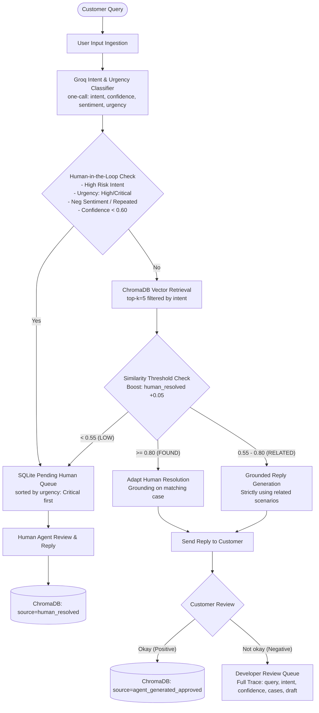

# Novintix — Production Customer Support Agent

An end-to-end, production-grade Customer Support Intelligence Platform built on real data, powered by **LangGraph**, **ChromaDB**, **Groq LLMs**, **FastAPI**, **SQLite**, and **React**.

---

## 1. System Architecture



---

## 2. Core Features & Capabilities

1. **Classifier Abstraction (`src/classifier.py`):**
   - Clean `BaseClassifier` interface enabling seamless swapping of model providers without altering agent routing logic.
   - Production `GroqClassifier` performs single-pass multi-attribute classification: intent, confidence ($0.0 - 1.0$), sentiment, urgency (`low`, `medium`, `high`, `critical`), urgency rationale, and high-risk flags.
2. **Dynamic Human-in-the-Loop (HITL) Gate:**
   - Automatically diverts critical tickets to human specialists before generating automated replies.
   - Enforces urgency signals: service outages, data loss, account lockouts, payment/billing disputes, and repeated unresolved contacts.
   - Human queue is strictly sorted by urgency so that **Critical** tickets always appear at the top.
3. **ChromaDB Vector Retrieval & Ranked Boost:**
   - 2,743 verified solved cases indexed with metadata (`intent`, `source`, `resolution`, `case_id`, `timestamp`).
   - Human-resolved cases receive a $+0.05$ score boost over agent-generated ones during retrieval.
4. **Calibrated Similarity Routing:**
   - $\ge 0.80$ (**FOUND**): Direct adaptation of the historical human resolution.
   - $0.55 - 0.80$ (**RELATED**): Grounded response generated strictly from related human-solved scenarios.
   - $< 0.55$ (**LOW**): Zero hallucinations; automatic escalation to human queue.
5. **Continuous Learning & Negative Feedback Telemetry:**
   - Positive feedback (`Okay`): deduplicated and added to vector store as `source="agent_generated_approved"`.
   - Negative feedback (`Not okay`): complete trace (query, intent, urgency, confidence, retrieved cases, draft reply, and customer comment) dispatched to the Developer Review page.

---

## 3. Empirical Data Quality Audit Findings

Audited on Kaggle dataset (`data/customer_support_tickets.csv`, 8,469 rows):
- **Raw Solved Count:** 2,769 closed rows with resolution string $\implies$ **2,743 unique rows after cleaning** (exceeds $\ge 1,000$ threshold with zero padding).
- **Priority Column Incoherence:** The dataset priority column is perfectly flat ($25.88\%$ Medium, $25.14\%$ Critical, $24.62\%$ High, $24.36\%$ Low), indicating synthetic assignment. In empirical audits, severe data loss tickets were marked "Low", while minor setup queries were marked "Critical". Hence, priority was excluded from ground truth.
- **Resolution Fidelity:** The raw Kaggle resolution column contains randomly generated 3–8 word Faker sentences (e.g., *"Case maybe show recently my computer follow."*).

---

## 4. Intent Taxonomy Discovery

Discovered via unsupervised cosine clustering on 8,398 embeddings (`all-MiniLM-L6-v2`) + two-pass Groq consolidation (`openai/gpt-oss-120b`):
1. `device_technical_issue_general` (Low Risk)
2. `hardware_failure_specific` (Low Risk)
3. `device_wifi_connectivity` (Low Risk)
4. `product_technical_issue_general` (Low Risk)
5. `account_login_failure` (High Risk)
6. `device_security_and_account` (High Risk)
7. `data_loss_recovery` (High Risk)
8. `billing_and_refund_dispute` (High Risk)
9. `order_and_cancellation_inquiry` (High Risk)
10. `other` (Low Risk)

Saved as versioned taxonomy: [`data/intent_taxonomy_v1.json`](file:///d:/Novintix/data/intent_taxonomy_v1.json).

---

## 5. Quick Start & Execution

### Prerequisites
- Python 3.11+
- Node.js 18+
- Groq API Key (in `.env`)

### 1. Setup Backend
```bash
# Install Python dependencies
pip install -r requirements.txt

# Run FastAPI backend
uvicorn src.api:app --reload --port 8000
```
Backend Swagger documentation available at: `http://localhost:8000/docs`

### 2. Setup Frontend
```bash
cd frontend
npm install
npm run dev
```
Frontend UI available at: `http://localhost:5173`

### 3. Vercel Deployment (Frontend)
The frontend contains [`frontend/vercel.json`](file:///d:/Novintix/frontend/vercel.json) ready for instant deployment:
```bash
cd frontend
npx vercel
```

### 4. Docker Deployment
```bash
docker-compose up --build
```
